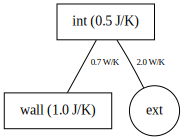

# a Python Thermal dynamic solver

solve "electric circuit like" dynamic thermal model


## low-level model definition

* **Nodes:** list of tuples `[(node id, mass, T0) , ...]`
* **Sources:** Dict `{name: array of length nbr_time_step, ...}`
* **Internal links:** list ot tuples `[(node A, node B, conductance value), ...]`
* **External links:** (i.e. with a source) list ot tuples `[(internal node, source name, conductance value), ...]`, set `conductance=None` if it is a direct heat source
* **dt**: time step value


## Graph the model

- using graphviz




## Notes

The solver uses as input the "low-level" model definition (nodes, internal_links, external_links, sources, dt), with numerical values

Higher level model description are useful. 

* topology: nodes_id, internal_links, external_links
* parameter object: name, value, prior distribution
* geometric description of the system: walls, windows,  materials properties... etc

```python
constructor(sources, ) --> solve(param)

model(sources, target) --> LL
model(param) --> Log-Prior
```

--> possible to do combinatorial bound estimation - or algeabric ?  [low estimate, high]

U = k*A*ep
2^3 = 8 possibilities

--> model reduction to a set of nodes, and eq. parameters